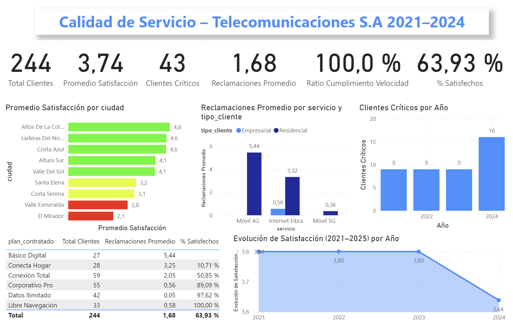

# 📡 Telecom Service Quality Analysis — BI Dashboard

**Customer Experience Intelligence** — End-to-end Power BI project analyzing service quality, satisfaction, and complaint patterns for a telecommunications company across 2021–2024.

    

*Dataset is simulated for educational purposes. All methodology follows real-world BI standards.*

---



---

## 🎯 What I Built

A full Business Intelligence solution transforming raw, heterogeneous customer data into actionable strategic insights. The project covers the complete data lifecycle: extraction, cleaning, dimensional modeling, DAX measure development, and interactive dashboard design — optimized for both desktop and mobile.

> *"From raw CSV to strategic dashboard — 244 records, 8 DAX measures, star schema model."*

| 👥 Clients | ⭐ Avg Satisfaction | 🚨 Critical Clients | 📋 Avg Claims | ⚡ Speed Compliance | ✅ % Satisfied |
|---|---|---|---|---|---|
| 244 | 3.74 | 43 | 1.68 | 100% | 63.9% |

---

## 🏗 Data Architecture

```
Raw Data (Excel + CSV — Simulated)
        │
        ▼
Power Query — Data cleaning & transformation
  · Remove duplicates and format errors
  · Separate units ("300 Mbps" → 300)
  · Normalize categorical fields
  · Impute missing age values using city median
  · Convert text to numeric formats
        │
        ▼
Star Schema Data Model
  · fact_clientes    → satisfaction, claims, real speed
  · dim_cliente      → demographics and client type
  · dim_plan         → contracted service plan
  · dim_servicio     → service type (4G, Fiber, 5G)
  · dim_ciudad       → geographic dimension
  · dim_fecha        → time dimension
        │
        ▼
DAX Measures Layer (8 strategic KPIs)
        │
        ▼
Power BI Dashboard — Interactive filters by year, city, client type
```

---

## 🧠 Key DAX Measures

```dax
-- % Satisfied clients (score ≥ 4)
Pct_Satisfechos =
DIVIDE(
    COUNTROWS(FILTER(fact_clientes, fact_clientes[satisfaccion] >= 4)),
    [Total_Clientes]
)

-- Speed compliance ratio
Ratio_Velocidad =
DIVIDE(
    AVERAGE(fact_clientes[velocidad_real]),
    AVERAGE(fact_clientes[velocidad_contratada])
)

-- Critical clients (satisfaction = 1)
Clientes_Criticos =
COUNTROWS(FILTER(fact_clientes, fact_clientes[satisfaccion] = 1))
```

---

## 🖥 Dashboard Overview

**6 KPI Cards** — Total clients · Avg satisfaction · Critical clients · Avg claims · Speed compliance · % Satisfied

**Satisfaction by City** — Horizontal bar chart ranking cities by avg satisfaction score

**Claims by Service & Client Type** — Grouped bar comparing Móvil 4G, Internet Fibra, Móvil 5G across Business and Residential segments

**Critical Clients by Year** — Annual trend of clients with satisfaction score = 1

**Plan Performance Table** — Per-plan breakdown of clients, avg claims, and % satisfied

**Satisfaction Evolution 2021–2024** — Line chart showing trend over time


---

## 🔧 Tech Stack

| Layer | Technology | Role |
|---|---|---|
| Raw Data | Excel + CSV | Simulated customer dataset |
| ETL | Power Query (M) | Data cleaning and transformation |
| Data Audit | Excel | Quality validation and documentation |
| Data Model | Star Schema | Dimensional modeling (1 fact + 5 dims) |
| Calculations | DAX | 8 strategic KPI measures |
| Visualization | Power BI Desktop | Interactive dashboard |
| Report | Word + PDF | Full written analysis and recommendations |

---

## 💡 Key Findings

| Finding | Detail |
|---|---|
| **Critical plan** | "Básico Digital" has avg satisfaction of 1.0 and 0% satisfied clients — service design failure |
| **Speed gap** | Real average speed = 28% of contracted speed — critical technical breach |
| **Geographic hotspots** | El Mirador and Valle Esmeralda concentrate the most critical cases — likely infrastructure issues |
| **Root cause confirmed** | High correlation between low real speed and high complaint volume — the problem is technical, not perceived |
| **Best performing plan** | "Datos Ilimitado" — 97.6% satisfied, avg 0.05 claims |
| **Satisfaction trend** | Declining since 2022 — from 3.80 to 3.64 in 2024 |

---

## 💡 Key Engineering Decisions

| Decision | Problem It Solves | Outcome |
|---|---|---|
| **Star schema over flat table** | Raw data was a single denormalized table — slow and hard to filter | Clean multi-dimensional model enabling efficient cross-filtering |
| **Median imputation by city** | Missing age values would bias city-level analysis | City-specific median preserves local demographic patterns |
| **Unit separation in Power Query** | "300 Mbps" stored as text — unusable for calculations | Numeric fields enabling speed ratio KPIs |
| **Mobile-optimized layout** | Default Power BI layouts break on small screens | Dashboard usable on any device without horizontal scrolling |

---

## 📄 Documentation

| Document | Description |
|---|---|
| [Final Project Report](Telecom_Final_Report.pdf) | Full written analysis, methodology and recommendations |
| [Data Quality Audit](Telecom_DataQuality_Audit.docx) | Data cleaning process, findings and validation results |

---

## 📁 Repository Contents

```
├── Telecom_ServiceQuality_Dashboard.pbix                     ← Power BI dashboard
├── Telecom_Final_Report.pdf                       ← Full written report
├── DW_Telecomunicaciones_Modelo.pdf                     ← Data model diagram
├── Telecom_DataQuality_Audit.docx                 ← Data quality audit
└── README.md
```

---

## 👤 About

Built by **Ignacio Dehoy** · Data Analyst & BI Specialist · Barcelona, Spain

*Built during my early days as a Data Analyst — part of my professional portfolio.*

- 👤 Open to new opportunities → [Connect on LinkedIn](https://linkedin.com/in/ignacio-dehoy-munoz/)

⭐ *If you found this project interesting, consider giving it a star!*
